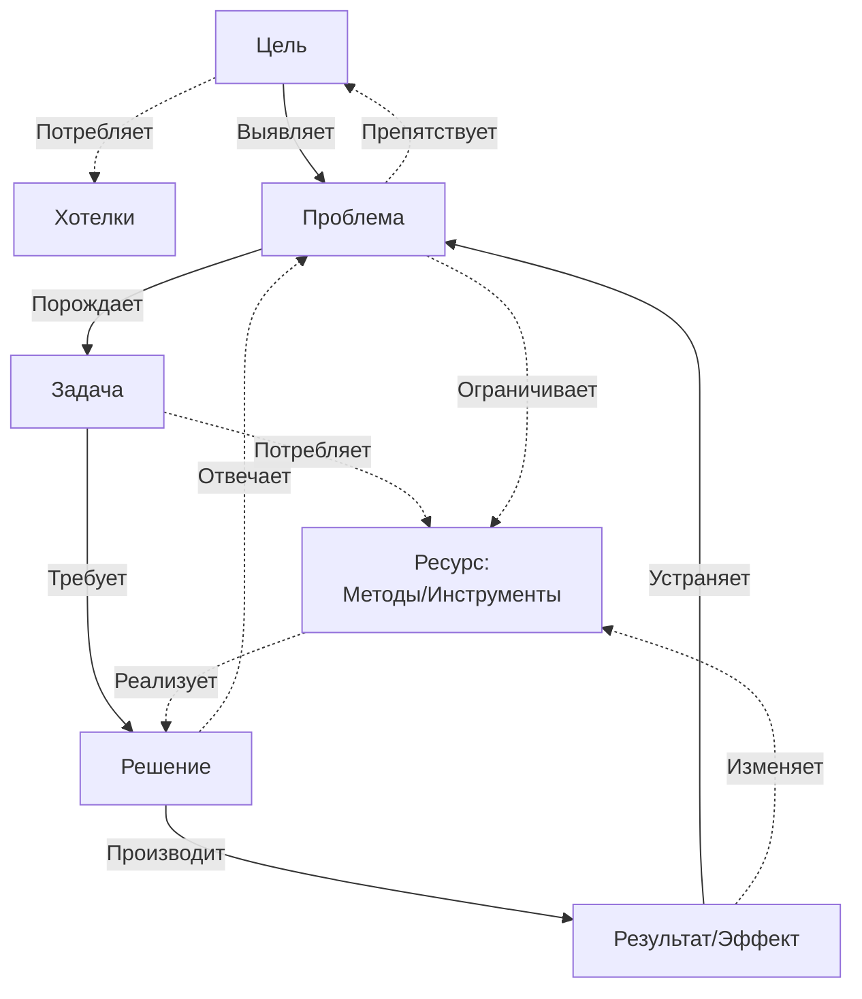

## 1. Определение базовых категорий

- **Цель (Target)** — описание желаемого состояния. Должна быть сравнима.
	- Выявляет Проблему
	- Дефолтная (максимальная) цель: получить максимум Ресурсов и наград, при минимально возможных рисках и затратах.

* **Проблема (Problem)** — препятствие, несоответствие между текущим и желаемым состоянием. Проблема может порождать несколько задач.
	* Порождает Решение
	* *Препятствует достижению Цели*
	* *Ограничивает доступный Ресурс*

- **Задача (Task)** — действие, которое необходимо выполнить для достижения желаемого состояния.  Должна иметь измеримый результат.
	- Требует Решения
	- *Потребляет Ресурсы* (всегда 0 или больше)

-  **Решение (Solution)** — ответ на проблему. Это общий подход или идея, которая отвечает проблеме.
	- Производит Решение
	- *Отвечает на проблему*
	- Отсутствие реализации решения равнозначно игнорированию.
    * Дефолтное решение любой проблемы: игнорирование + выполнение задачи, если она сформулирована.

*   **Результат (Outcome) / Эффект (Effect)** — итог применения Решения, выполнения Задачи. Это то, что было достигнуто.
	* Решает Задачу
	- *Изменяет доступный Ресурс* (в ту или иную сторону)
	* Эффект проблемы: результат решения "Игнорировать"

-  **Ресурс (Resource)**  - это совокупность доступных инструментов, методов и иных исчисляемых факторов которые можно задействовать для решения Задачи.
	- Реализует Решение

## 2. Отношения между категориями

### Таблица отношений

|  Отношения →  |     Цель     | Проблема  |  Задача   |  Решение  | Результат  |    Ресурс    |
| :-----------: | :----------: | :-------: | :-------: | :-------: | :--------: | :----------: |
|   **Цель**    |      -       | Выявляет  |           |           |            |              |
| **Проблема**  | Препятствует |     -     | Порождает |           |            | Ограничивает |
|  **Задача**   |              |           |     -     |  Требует  |            |  Потребляет  |
|  **Решение**  |              | Отвечает  |           |     -     | Производит |              |
| **Результат** |              | Устраняет |           |           |     -      |   Изменяет   |
|  **Ресурс**   |              |           |           | Реализует |            |      -       |
### Граф отношений:

---

## 3.  Валидация схемы

Схема демонстрирует прочность и гибкость. Она выдерживает проверку на такие сложные случаи, как неполное решение проблемы (порождает новый цикл), конфликт целей (решается через мета-задачи) и даже пассивное поведение, такое как игнорирование (формализуется как валидное решение, потребляющее специфический ресурс — готовность принять риск).

Было установлено, что в рамках единичного цикла ресурс пассивен, однако его активность моделируется через рекурсию: любой активный ресурс сам является автономной системой, работающей по той же схеме. Таким образом, модель масштабируется от одиночного цикла до сети взаимодействующих процессов, где результат одного цикла может стать проблемой или ресурсом для другого.

В итоге, схема подтверждает свою жизнеспособность как инструмент для анализа и проектирования сложных систем, от бизнес-процессов до программных алгоритмов, благодаря своей замкнутости, итеративности и способности описывать динамическое преобразование ресурсов.