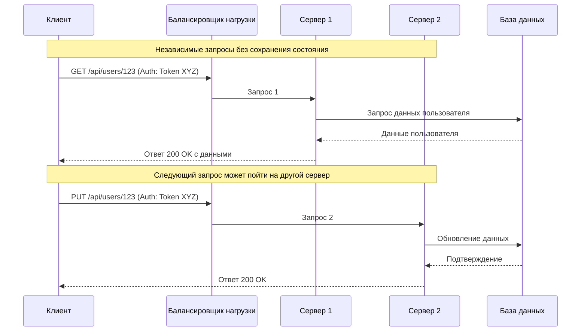
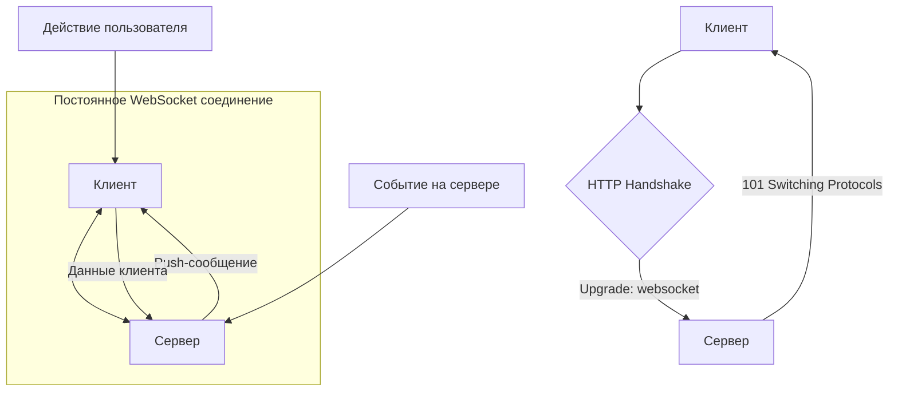
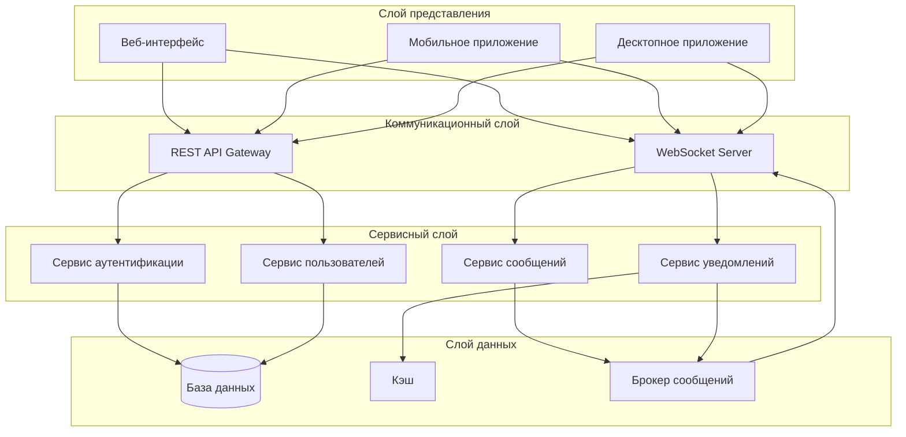

## Глубокий анализ принципов работы

### REST API: Архитектура запрос-ответ

REST (Representational State Transfer) представляет собой архитектурный стиль, который использует протокол HTTP в качестве транспортного уровня и опирается на его методы (GET, POST, PUT, DELETE, PATCH) для выполнения операций с ресурсами. Ключевой философией REST является представление данных в виде ресурсов, каждый из которых имеет уникальный идентификатор (URI), и манипуляция этими ресурсами через стандартизированные интерфейсы.

**Цикл взаимодействия в REST API** начинается с инициации клиентом HTTP-запроса, содержащего метод, заголовки, путь к ресурсу и опциональное тело сообщения. Сервер, получив запрос, обрабатывает его, выполняя необходимые операции с данными, и формирует ответ, включающий статусный код, заголовки и тело ответа. После отправки ответа соединение закрывается, что делает каждую транзакцию независимой и изолированной.

Важной характеристикой REST является его **безсостоятельность** (stateless). Сервер не хранит информацию о состоянии клиента между запросами. Любой необходимый контекст должен передаваться клиентом в каждом запросе, обычно через заголовки аутентификации, токены или параметры. Это свойство значительно упрощает масштабирование системы, поскольку любой сервер может обработать любой запрос, не требуя доступа к состоянию конкретного клиента.

### WebSocket: Постоянное двустороннее соединение

WebSocket представляет собой протокол связи поверх TCP, который обеспечивает **полнодуплексный канал связи** между клиентом и сервером. В отличие от HTTP, где соединение инициируется только клиентом и немедленно закрывается после ответа, WebSocket устанавливает постоянное соединение, позволяющее обеим сторонам отправлять данные в любое время без необходимости создания новых запросов.

**Процесс установления соединения WebSocket** начинается с "рукопожатия" (handshake), которое выполняется через обычный HTTP-запрос с заголовком `Upgrade: websocket`. Сервер, поддерживающий WebSocket, подтверждает переход на протокол WebSocket, после чего базовое TCP-соединение остается открытым, и обе стороны могут начинать передачу данных в формате "кадров" (frames). Эти кадры имеют минимальные служебные заголовки, что делает передачу данных очень эффективной.

После установления соединения **коммуникационная модель кардинально меняется**: сервер может самостоятельно инициировать отправку данных клиенту без ожидания запроса. Это открывает возможности для push-уведомлений, трансляции обновлений в реальном времени и интерактивного взаимодействия с минимальной задержкой. Соединение остается активным до тех пор, пока одна из сторон явно не закроет его или не произойдет сетевой сбой.

## Детальное сравнение характеристик

### Модель коммуникации и инициация взаимодействия

**REST API** следует традиционной модели "клиент-сервер", где клиент всегда является инициатором взаимодействия. Эта асимметричная модель хорошо подходит для сценариев, где данные запрашиваются по необходимости, а не доставляются при изменении. Однако это создает фундаментальное ограничение: сервер не может уведомить клиента о событиях, произошедших на сервере, без предварительного запроса от клиента. Для имитации push-уведомлений в REST используются техники вроде длинных опросов (long-polling) или периодических запросов (polling), которые имеют существенные недостатки в виде задержек и избыточной нагрузки на сеть.

**WebSocket** устанавливает симметричную модель, где любая сторона может инициировать передачу данных. Это устраняет необходимость в постоянных опросах и позволяет реализовать истинные push-уведомления. Сервер может мгновенно реагировать на события и отправлять обновления всем подключенным клиентам или определенным их группам. Такая модель особенно ценна в приложениях, где время отклика критически важно, таких как онлайн-игры, финансовые платформы или инструменты для совместной работы.

### Эффективность передачи данных и сетевые накладные расходы

В **REST API** каждый запрос содержит полный набор HTTP-заголовков, включая информацию о кэшировании, куки, тип содержимого, заголовки аутентификации и другие метаданные. Для типичного REST-запроса размер заголовков может составлять от 500 байт до нескольких килобайт. При частых запросах эти накладные расходы становятся значительными, особенно в мобильных приложениях, где важно экономить трафик и заряд батареи. Кроме того, установка и разрыв TCP-соединения для каждого запроса также создает дополнительную нагрузку.

**WebSocket**, после установления начального соединения, передает данные в виде компактных кадров с минимальными служебными заголовками (от 2 до 14 байт в зависимости от размера данных). Это делает протокол исключительно эффективным для частого обмена небольшими сообщениями. Постоянное соединение также устраняет затраты на многократное установление TCP-соединений и выполнение SSL/TLS handshake при использовании защищенного соединения (WSS).

### Управление состоянием и сессиями

**Безсостоятельность REST API** является одновременно его сильной и слабой стороной. С одной стороны, она упрощает масштабирование, отказоустойчивость и кэширование. С другой стороны, это означает, что любая информация о состоянии клиента должна либо передаваться с каждым запросом, либо храниться на стороне клиента, либо сохраняться в распределенном хранилище, доступном всем экземплярам сервера. Для реализации механизмов аутентификации и авторизации в REST обычно используются токены (например, JWT), которые передаются с каждым запросом и содержат всю необходимую информацию для проверки прав доступа.

**WebSocket**, напротив, по своей природе является **состоятельным** (stateful). Сервер должен отслеживать активные соединения и ассоциировать их с конкретными пользователями или сессиями. Это усложняет архитектуру при горизонтальном масштабировании: если клиент подключен к одному серверу, а сообщение для него генерируется на другом сервере, необходимы механизмы межсерверной коммуникации для доставки этого сообщения. Для решения этой проблемы используются такие подходы, как общие подписки Redis Pub/Sub, специализированные брокеры сообщений или использование "липких" сессий на балансировщиках нагрузки.

### Масштабируемость и архитектурные соображения

**Масштабируемость REST API** относительно проста благодаря его безсостоятельности. Новые экземпляры серверов можно добавлять без необходимости синхронизации состояния между ними. Запросы могут балансироваться случайным образом, по алгоритму round-robin или на основе текущей загрузки серверов. Кэширование ответов на уровне прокси-серверов или CDN дополнительно снижает нагрузку на серверы приложений. Статичные или редко изменяющиеся ресурсы могут эффективно кэшироваться на различных уровнях инфраструктуры.

**Масштабирование приложений, использующих WebSocket**, представляет более сложную задачу. Каждое соединение требует памяти и вычислительных ресурсов на сервере, к которому подключен клиент. При добавлении новых серверов необходимо либо перенаправлять новых клиентов на менее загруженные серверы, либо реализовывать механизмы миграции существующих соединений. Для широковещательных сообщений или сообщений в группах требуется координация между серверами, чтобы гарантировать доставку сообщений всем подписчикам независимо от того, к какому серверу они подключены. Современные решения включают использование специализированных сервисов вроде Socket.IO с адаптерами для кластеризации или платформ реального времени, таких как Pusher, Ably или Azure SignalR Service.

## Расширенный анализ преимуществ и ограничений

### Преимущества REST API

1. **Универсальность и стандартизация**: REST построен на стандартах HTTP, которые поддерживаются практически всеми платформами и языками программирования. Это обеспечивает высокую степень интероперабельности между различными системами.

2. **Идемпотентность и безопасность методов**: HTTP-методы имеют четко определенную семантику. GET-запросы являются безопасными и идемпотентными (повторение запроса дает тот же результат), что позволяет кэшировать их ответы. PUT и DELETE также являются идемпотентными, что упрощает обработку ошибок и повторные попытки.

3. **Развитая экосистема инструментов**: Существует огромное количество инструментов для разработки, тестирования, документирования и мониторинга REST API. Swagger/OpenAPI, Postman, curl, встроенные средства разработчика в браузерах — все они ориентированы на работу с HTTP.

4. **Наследование инфраструктурных преимуществ HTTP**: REST API может использовать существующую HTTP-инфраструктуру: балансировщики нагрузки, прокси-серверы, кэши, системы защиты от DDoS, CDN. Это снижает операционные расходы и ускоряет развертывание.

5. **Простота отладки и логирования**: Каждый запрос и ответ являются самодостаточными и могут быть легко залогированы, проанализированы и воспроизведены. Это упрощает отладку, аудит и расследование инцидентов.

### Ограничения REST API

1. **Проблема N+1 запросов**: Для получения связанных данных часто требуется выполнение множества запросов. Например, для получения информации о пользователе и его заказах может потребоваться отдельный запрос для каждого заказа, что создает значительную нагрузку и увеличивает задержку.

2. **Избыточность или недостаточность данных (over-fetching/under-fetching)**: Клиент может получать либо больше данных, чем необходимо (тратя лишний трафик), либо меньше (требуя дополнительных запросов). GraphQL был разработан именно для решения этой проблемы, но он представляет собой альтернативу REST, а не WebSocket.

3. **Отсутствие стандартизированной реализации**: Несмотря на принципы REST, их интерпретация и реализация могут значительно различаться между разными API. Нет единого стандарта на формат ошибок, пагинацию, версионирование или гипермедиа-ссылки.

4. **Сложность реализации сложных операций**: Транзакции, затрагивающие несколько ресурсов, или сложные бизнес-процессы могут требовать нестандартных эндпоинтов, что нарушает чистоту RESTful дизайна.

### Преимущества WebSocket

1. **Минимальная задержка передачи данных**: После установления соединения данные могут передаваться практически мгновенно, без накладных расходов на установление соединения и заголовки HTTP. Это критически важно для приложений реального времени.

2. **Эффективность использования ресурсов**: Для частого обмена небольшими сообщениями WebSocket значительно эффективнее HTTP. Это особенно заметно в мобильных приложениях, где экономия трафика и заряда батареи напрямую влияет на пользовательский опыт.

3. **Устойчивость к сетевым проблемам**: Протокол включает механизмы контроля активности (ping/pong фреймы) для обнаружения разорванных соединений. Многие реализации клиентских библиотек автоматически пытаются восстановить соединение при его разрыве.

4. **Поддержка бинарных данных и текста**: WebSocket может передавать как текстовые, так и бинарные данные, что делает его универсальным для различных сценариев: от чатов до потоковой передачи аудио и видео (хотя для медиа обычно используются специализированные протоколы).

5. **Совместимость с существующей инфраструктурой**: WebSocket использует стандартные порты HTTP (80) и HTTPS (443), что позволяет ему обходить большинство корпоративных брандмауэров, в отличие от других протоколов реального времени, которые могут использовать нестандартные порты.

### Ограничения WebSocket

1. **Сложность управления жизненным циклом соединений**: Разработчики должны явно обрабатывать установку, поддержание и закрытие соединений. Неправильное управление может привести к утечкам памяти или ресурсов на сервере.

2. **Отсутствие встроенного кэширования и балансировки**: Промежуточные прокси и кэширующие серверы, оптимизированные для HTTP, не всегда корректно работают с WebSocket. Балансировка нагрузки требует специальных конфигураций для поддержания "липких" сессий.

3. **Проблемы с мобильными устройствами**: Мобильные сети и операционные системы могут агрессивно управлять фоновыми соединениями для экономии заряда батареи. Это может приводить к неожиданным разрывам соединений или задержкам в доставке сообщений.

4. **Сложность тестирования и отладки**: Отладка WebSocket-соединений требует специализированных инструментов, таких как WebSocket-инспекторы или расширенные возможности разработчика в браузерах. Автоматизированное тестирование также сложнее по сравнению с REST API.

5. **Ограниченная поддержка в legacy-системах**: Старые прокси-серверы, балансировщики нагрузки или сетевые устройства могут не корректно обрабатывать WebSocket-трафик, особенно при длительных соединениях.

## Детальные сценарии использования

### Идеальные сценарии для REST API

**Корпоративные информационные системы и CRM**: В системах управления взаимоотношениями с клиентами и корпоративных порталах типичные операции — просмотр, фильтрация, сортировка и редактирование записей. Эти операции хорошо отображаются на CRUD-операции REST. Кэширование часто запрашиваемых данных (справочники, конфигурации) значительно повышает производительность.

**Электронная коммерция и платежные системы**: Платформы электронной коммерции имеют четко определенные ресурсы: товары, категории, корзины, заказы, пользователи. REST API идеально подходит для операций с этими ресурсами. Безопасность и идемпотентность операций критически важны для платежных транзакций.

**Мобильные приложения с прерывистым соединением**: Мобильные приложения, которые должны работать в условиях нестабильного интернета, выигрывают от модели "запрос-ответ". Локальное кэширование ответов и механизмы повторных попыток позволяют обеспечить надежную работу даже при временной потери связи.

**Публичные API для сторонних разработчиков**: При предоставлении доступа к данным или функциональности внешним разработчикам REST API является стандартом де-факто. Стандартизированная структура, понятная документация и совместимость с существующими инструментами разработки снижают порог входа для интеграции.

**Сервисы с высокой нагрузкой на чтение**: Новостные порталы, блоги, каталоги продукции и другие сервисы, где операции чтения значительно преобладают над операциями записи, эффективно используют кэширование HTTP, что значительно снижает нагрузку на серверы приложений и базы данных.

### Идеальные сценарии для WebSocket

**Интерактивные системы совместной работы**: Редакторы документов (Google Docs), доски для мозгового штурма (Miro), инструменты для совместного программирования. В этих системах важно мгновенно отражать изменения, внесенные одним пользователем, для всех остальных участников сессии.

**Многопользовательские онлайн-игры**: Игры в реальном времени требуют синхронизации состояния между всеми игроками с минимальной задержкой. Каждое действие игрока должно немедленно транслироваться другим участникам, а обновления состояния игры — доставляться всем клиентам одновременно.

**Финансовые торговые платформы и дашборды**: Биржевые тикеры, графики цен в реальном времени, уведомления о значительных изменениях рынка. Даже миллисекундные задержки в получении информации могут иметь существенные финансовые последствия.

**Системы мониторинга и оповещений**: Панели мониторинга ИТ-инфраструктуры, систем промышленного контроля, трекеры доставки. Мгновенное отображение изменений состояния системы позволяет операторам быстро реагировать на инциденты.

**Интерактивные стриминговые платформы**: Сервисы, где зрители могут взаимодействовать с трансляцией: голосования, викторины, сбор донатов с отображением в реальном времени. WebSocket обеспечивает двустороннюю связь между стримером и аудиторией.

**Приложения для обмена сообщениями в реальном времени**: Чаты, мессенджеры, системы поддержки клиентов с онлайн-консультантами. Пользователи ожидают, что сообщения будут доставляться мгновенно, а статусы "печатает сообщение" или "прочитано" — обновляться без задержек.

## Практические аспекты совместного использования

В современных сложных приложениях REST API и WebSocket редко используются изолированно. Более распространенным является их совместное использование, где каждый протокол отвечает за ту часть функциональности, для которой он наиболее подходит.

### Типичная архитектура гибридного приложения

1. **Инициализация и аутентификация через REST**: Приложение начинает работу с вызова REST API для аутентификации пользователя и получения начального состояния приложения (профиль пользователя, настройки, исторические данные). REST идеально подходит для этих операций, так как они выполняются однократно при запуске.

2. **Установка WebSocket-соединения**: После успешной аутентификации клиент устанавливает WebSocket-соединение, передавая токен сессии или аутентификации для ассоциации соединения с конкретным пользователем.

3. **Разделение ответственности**: 
   - REST API используется для операций, инициируемых пользователем: отправка формы, загрузка файлов, выполнение сложных запросов к данным
   - WebSocket используется для push-уведомлений, обновлений в реальном времени, чатов и любых других сценариев, где сервер должен инициировать взаимодействие

4. **Синхронизация состояния**: При получении обновлений через WebSocket клиент может выполнять дополнительные REST-запросы для получения полных данных или проверки состояния.

### Паттерны интеграции REST и WebSocket

**Паттерн "Запрос через REST, обновления через WebSocket"**: Пользователь выполняет действие через REST API (например, размещает заказ), после чего подписывается на обновления статуса этого заказа через WebSocket. Сервер отправляет уведомления о каждом изменении статуса через установленное соединение.

**Паттерн "Кэширование с инвалидацией через WebSocket"**: Клиент кэширует данные, полученные через REST API. При изменении этих данных на сервере, сервер отправляет сообщение через WebSocket всем заинтересованным клиентам, указывая, какие данные устарели. Клиенты могут либо немедленно обновить данные, либо пометить их как устаревшие для обновления при следующем обращении.

**Паттерн "Команда через REST, события через WebSocket"**: Пользователь инициирует длительную операцию через REST API (например, генерацию отчета). Сервер принимает команду и немедленно возвращает идентификатор задачи. Затем через WebSocket отправляются уведомления о прогрессе выполнения, а по завершении — результат операции или ссылка на него.

### Управление соединениями и восстановление

При совместном использовании REST и WebSocket важно обеспечить согласованность состояния между двумя каналами связи. Типичная реализация включает:

1. **Синхронизация сессий**: Токен аутентификации, полученный через REST, должен быть валиден и для установки WebSocket-соединения. Это обеспечивает, что оба канала ассоциированы с одним пользователем.

2. **Восстановление состояния при переподключении**: Если WebSocket-соединение разрывается и восстанавливается, клиент должен повторно подписаться на интересующие его каналы или обновления. Для этого может использоваться механизм "сессий" на сервере, хранящий информацию о подписках клиента.

3. **Обработка конфликтов**: Если клиент изменяет данные через REST одновременно с получением обновлений через WebSocket, необходимо определить стратегию разрешения конфликтов: приоритет последнего изменения, блокировки или слияния изменений.

## Эволюция технологий и будущие тенденции

### HTTP/2 и Server-Sent Events

Появление HTTP/2 внесло значительные изменения в ландшафт клиент-серверной коммуникации. Мультиплексирование потоков в рамках одного соединения, приоритизация запросов и server push частично адресовали недостатки традиционного HTTP/1.1. Однако даже HTTP/2 сохраняет модель "запрос-ответ", где серверный push инициируется в ответ на клиентский запрос.

Server-Sent Events (SSE) предоставляют альтернативу WebSocket для сценариев, где нужна односторонняя коммуникация от сервера к клиенту. SSE проще в реализации, чем WebSocket, и автоматически обрабатывают повторное подключение, но не поддерживают двустороннюю связь.

### GraphQL и альтернативы REST

GraphQL, разработанный Facebook, предлагает альтернативный REST подход к проектированию API, позволяя клиентам точно определять, какие данные им нужны, и получать их за один запрос. Важно понимать, что GraphQL не является заменой WebSocket — он решает проблему over-fetching/under-fetching в REST, но сохраняет модель запрос-ответ. Для работы в реальном времени GraphQL предлагает спецификацию subscriptions, которая обычно реализуется поверх WebSocket.

### gRPC и протоколы на основе бинарных форматов

gRPC, использующий HTTP/2 в качестве транспортного протокола и Protocol Buffers в качестве формата сериализации, предлагает высокопроизводительную альтернативу REST API для внутренней коммуникации между сервисами. Для потоковой передачи данных gRPC поддерживает однонаправленные и двунаправленные потоки, что в некоторых сценариях может конкурировать с WebSocket.

### WebTransport и будущее веб-коммуникаций

Разрабатываемый стандарт WebTransport предлагает современный API для клиент-серверной коммуникации, сочетающий преимущества WebSocket и QUIC (протокол транспортного уровня, лежащий в основе HTTP/3). WebTransport поддерживает множество потоков данных с индивидуальным контролем перегрузки, что делает его перспективной технологией для приложений реального времени, особенно для медиа-стриминга и игр.

## Рекомендации по выбору подхода

При выборе между REST API, WebSocket или их комбинацией, следует учитывать следующие факторы:

### Выбирайте REST API, если:

1. **Операции преимущественно инициируются клиентом**: Пользователь сам решает, когда запросить данные или выполнить действие.
2. **Кэширование критически важно**: Данные относительно статичны или изменяются редко, и их кэширование значительно снижает нагрузку.
3. **Требуется широкая совместимость**: API будет использоваться различными клиентами, включая legacy-системы или сторонних разработчиков.
4. **Операции атомарны и независимы**: Каждый запрос представляет собой законченную транзакцию, не требующую поддержания состояния между запросами.
5. **Инфраструктурные ограничения**: Существующая инфраструктура оптимизирована для HTTP и не поддерживает WebSocket.

### Выбирайте WebSocket, если:

1. **Требуется минимальная задержка**: Даже небольшие задержки негативно влияют на пользовательский опыт.
2. **Сервер должен инициировать взаимодействие**: Данные изменяются на сервере, и клиенты должны немедленно получать обновления.
3. **Частый обмен небольшими сообщениями**: Приложение предполагает постоянный поток данных в обоих направлениях.
4. **Состояние соединения важно**: Приложение требует знания о том, какие пользователи онлайн, их статус или активность.
5. **Двусторонняя интерактивность**: Клиенты и сервер активно взаимодействуют друг с другом в режиме диалога.

### Используйте комбинацию REST и WebSocket, если:

1. **Приложение комплексное**: Оно включает как традиционные CRUD-операции, так и функциональность реального времени.
2. **Необходимо разделить ответственность**: Разные команды могут работать над разными частями API, используя наиболее подходящие технологии.
3. **Постепенная миграция**: Существующее приложение на REST API расширяется функциональностью реального времени без полного переписывания.
4. **Различные требования к надежности**: Критические операции выполняются через REST с гарантией доставки, а обновления в реальном времени — через WebSocket.

## Заключение

REST API и WebSocket представляют два принципиально разных подхода к организации клиент-серверного взаимодействия, каждый из которых оптимизирован для определенного класса задач. REST API, с его безсостоятельной архитектурой "запрос-ответ", остается доминирующим выбором для большинства веб-сервисов, публичных API и приложений, где операции преимущественно инициируются клиентом. Его сила — в простоте, стандартизации и богатой экосистеме.

WebSocket, обеспечивающий постоянное двустороннее соединение, незаменим для приложений реального времени, где важна минимальная задержка и возможность push-уведомлений от сервера. Несмотря на большую сложность в реализации и масштабировании, он открывает возможности для создания принципиально нового класса интерактивных веб-приложений.

В реальности современные сложные приложения редко ограничиваются одним подходом. Архитекторы все чаще применяют гибридные решения, где REST API используется для инициализации, аутентификации и выполнения атомарных операций, а WebSocket — для обновлений в реальном времени и интерактивных функций. Понимание сильных и слабых сторон каждого подхода, а также умение их комбинировать, является ключевым навыком для разработки эффективных, масштабируемых и отзывчивых распределенных систем.

По мере развития веб-стандартов и появления новых протоколов, таких как HTTP/3 и WebTransport, ландшафт клиент-серверной коммуникации продолжит меняться. Однако фундаментальные принципы, лежащие в основе REST и WebSocket — разделение ответственности, эффективность коммуникации и соответствие архитектуры решаемым задачам — останутся актуальными независимо от конкретных технологических реализаций.