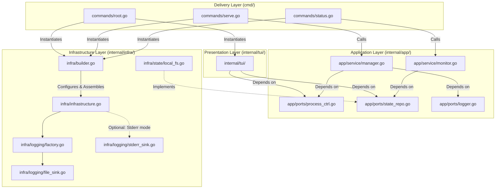

# Architectural Recommendations for CLI Applications using `urfave/cli/v3`

**Document Version**: 1.2  
**Last Updated**: 2026-04-19  
**Target Audience**: Go developers designing CLI tools  
**Scope**: Medium to high complexity applications with modular architecture

---

## 1. Introduction

This document establishes a set of architectural recommendations for building CLI applications using the `urfave/cli/v3` library. The recommendations are formulated based on analysis of command lifecycle, testability requirements, Clean Architecture principles, and dependency management practices in the Go ecosystem.

The document's goal is to provide a reproducible template for design decisions that minimizes technical risks (cyclic dependencies, implicit side effects, testing complexity) and ensures explicit data flows.

---

## 2. Example Application: `taskflow`

To illustrate the recommendations, we use a fictional application `taskflow` — a task orchestration tool with migration support.

**Functional Requirements**:
- Root command (no explicit name): launches the application in interactive TUI mode with a terminal dashboard
- Subcommand `serve`: launches all processes in autonomous cyclic mode (daemon)
- Subcommand `status`: reads state repositories/files, outputs a brief summary, and exits

**Non-Functional Requirements**:
- Minimal startup time for simple commands (`status`)
- Ability to test business logic without launching the CLI parser
- Explicit resource lifecycle management
- Separation of logging configuration: TUI mode writes only to file, CLI mode (`serve`) writes to both file and `stderr`

---

## 3. Repository Structure

```text
taskflow/
├── cmd/
│   └── taskflow/
│       ├── main.go                 # Entry point: cli.Run()
│       └── commands/
│           ├── root.go             # Root command -> TUI initialization
│           ├── serve.go            # Subcommand "serve" -> process launcher
│           └── status.go           # Subcommand "status" -> state reader
├── internal/
│   ├── tui/                        # TUI specifics (Presentation Layer)
│   │   ├── dashboard.go            # TUI model (interface state)
│   │   ├── view.go                 # View (terminal rendering)
│   │   └── controller.go           # User interaction logic
│   ├── app/
│   │   ├── service/
│   │   │   ├── manager.go          # Use case: process management
│   │   │   └── monitor.go          # Use case: state reading
│   │   └── ports/
│   │       ├── process_ctrl.go     # Process control interface
│   │       ├── state_repo.go       # State repository interface
│   │       └── logger.go           # Logging interface
│   ├── domain/
│   │   ├── task.go                 # Domain entities and constants
│   │   ├── errors.go               # Domain errors
│   │   └── types.go                # Shared domain types
│   └── infra/
│       ├── builder.go              # Modular Infrastructure Builder
│       ├── infrastructure.go       # Structure of ready components
│       ├── logging/
│       │   ├── factory.go          # Logger factory (file/stderr)
│       │   └── sinks.go            # Output implementations
│       └── state/
│           └── local_fs.go         # State read/write implementation
├── pkg/
│   ├── types/                      # Common types (cross-layer, non-domain)
│   └── config/                     # Configuration loading utilities
├── go.mod
└── README.md
```

---

## 4. Dependency Graph (Mermaid)

The diagram demonstrates how different commands (Root/TUI, Serve, Status) use the **same** builder but configure it differently, obtaining different infrastructure-level dependency graphs (e.g., logger).



**Diagram Explanation**:
- Solid arrows: direct imports and calls.
- Dashed arrows: interface satisfaction (implementation depends on abstraction, but abstraction doesn't know about implementation).
- Color coding: architecture layers (Delivery → Presentation → Application → Infrastructure).

---

## 5. Detailed Recommendation Justification

### 5.1. Builder in `ActionFunc`, Concrete Type, Functional Options

**Recommendation**:
Infrastructure component initialization is performed inside each command's `ActionFunc` via a modular builder returning a concrete structure `*Infrastructure`. The builder is configured through functional options (`WithDB()`, `WithLogger()`). Configuration is passed via the `WithConfig(*config.Config)` option.

**Justification**:
1. **Explicit lifecycle**: `ActionFunc` is the single entry point for command business logic. Placing initialization here makes the data flow linear and predictable.
2. **Minimal dependencies**: The `status` command calls `builder.WithStateRepo().Build()`, the `serve` command calls `builder.WithDB().WithLogger().Build()`. This avoids opening unused connections.
3. **Testability**: The builder can be mocked or replaced with a test implementation without changing the `ActionFunc` signature.
4. **Static typing**: Returning a concrete structure (`*Infrastructure`) allows the compiler to check field access. Avoiding `any` prevents runtime errors.

**Example**:
```go
// internal/infra/builder.go
type Builder struct {
    ctx        context.Context
    config     *config.Config
    components []func(*Infrastructure) error
}

func NewBuilder(ctx context.Context) *Builder {
    return &Builder{
        ctx:        ctx,
        components: make([]func(*Infrastructure) error, 0),
    }
}

func (b *Builder) WithConfig(cfg *config.Config) *Builder {
    b.config = cfg
    return b
}

func (b *Builder) WithDB() *Builder {
    b.components = append(b.components, func(i *Infrastructure) error {
        if b.config == nil {
            return errors.New("config required for DB initialization")
        }
        db, err := pgxpool.New(b.ctx, b.config.DSN)
        if err != nil { return err }
        i.DB = db
        return nil
    })
    return b
}

func (b *Builder) Build() (*Infrastructure, error) {
    infra := &Infrastructure{Logger: slog.Default()}
    for _, fn := range b.components {
        if err := fn(infra); err != nil {
            return nil, err
        }
    }
    return infra, nil
}

// internal/infra/infrastructure.go
type Infrastructure struct {
    Logger *slog.Logger
    DB     *pgxpool.Pool  // concrete type, not interface
    // other components...
}

func (i *Infrastructure) Close() error {
    if i.DB != nil {
        i.DB.Close()
    }
    return nil
}
```

```go
// cmd/commands/migrate.go
func MigrateAction() cli.ActionFunc {
    return func(ctx context.Context, cmd *cli.Command) error {
        cfg, err := config.LoadFromCLI(cmd)
        if err != nil { return err }

        infra, err := infra.NewBuilder(ctx).
            WithConfig(cfg).  // Explicit configuration passing
            WithDB().
            Build()
        if err != nil { return fmt.Errorf("build infra: %w", err) }
        defer infra.Close() // critical cleanup

        return app.NewMigrator(infra.DB).Run(ctx, cfg.MigrationsPath)
    }
}
```

---

### 5.2. `Before`: Flag Validation and Lightweight Context Enrichment

**Recommendation**:
The `Before` hook is used for:
- Validating required flags (in `urfave/cli/v3`, all command flags are already parsed by the time `Before` is called).
- Enriching `context.Context` with lightweight data (logger level, request identifier).
- Returning errors via `cli.Exit` or compatible mechanisms for correct message display.

**Justification**:
1. **Safe flag access**: In `urfave/cli/v3`, argument parsing completes before `Before` is called, making flag value reading deterministic.
2. **Separation of concerns**: Input validation is separated from business logic but not placed in an implicit infrastructure initialization hook.
3. **Correct error handling**: Using `cli.Exit` ensures the library displays the message and exits the process with the correct code without panicking.

**Example**:
```go
// cmd/commands/serve.go
func ServeCommand() *cli.Command {
    return &cli.Command{
        Name:  "serve",
        Flags: []cli.Flag{
            &cli.StringFlag{Name: "task-id", Required: true},
            &cli.StringFlag{Name: "priority", Value: "normal"},
        },
        Before: func(ctx context.Context, cmd *cli.Command) (context.Context, error) {
            // Business rule validation for flags
            priority := cmd.String("priority")
            if !slices.Contains([]string{"low", "normal", "high"}, priority) {
                // cli.Exit returns a special error type that 
                // urfave/cli intercepts and exits the process with the specified code.
                // Return it as a regular error.
                return ctx, cli.Exit("invalid priority value", 1)
            }
            // Context enrichment
            logger := slog.Default().With("task_id", cmd.String("task-id"))
            return context.WithValue(ctx, loggerKey, logger), nil
        },
        Action: ServeAction(),
    }
}
```

---

### 5.3. `After`: Only for Optional Telemetry; Cleanup via `defer`

**Recommendation**:
The `After` hook is used exclusively for optional operations: sending completion metrics, logging execution status. Releasing critical resources (closing DB connections, committing transactions) is performed via `defer` directly in `ActionFunc`.

**Justification**:
1. **Execution guarantees**: `defer` in `ActionFunc` executes on any function exit, including error returns. The `After` hook may not execute when:
   - A panic occurs that is not caught by the library.
   - `os.Exit()` is called inside `ActionFunc`.
   - The process is interrupted by `SIGKILL`.
2. **Responsibility localization**: A resource opened in `ActionFunc` is closed in the same scope, simplifying code analysis and preventing leaks.
3. **Testability**: Cleanup logic does not depend on library hook behavior, simplifying isolated test writing.

**Example**:
```go
// cmd/commands/serve.go
func ServeAction() cli.ActionFunc {
    return func(ctx context.Context, cmd *cli.Command) error {
        // ... initialization ...
        infra, err := builder.Build()
        if err != nil { return err }
        defer infra.Close() // guaranteed cleanup

        startTime := time.Now()
        err = app.NewRunner(infra.DB).Execute(ctx, taskID)
        
        // After logic: optional telemetry
        metrics.RecordDuration("task_run", time.Since(startTime))
        metrics.RecordErrorIf(err != nil)
        
        return err
    }
}
```

---

### 5.4. Configuration: Manual Loading with Explicit Source Priority

**Recommendation**:
For configuration loading, prefer explicit manual integration over third-party libraries that expect incompatible flag systems (e.g., `viper.BindPFlag` expects `pflag.FlagSet`, which `urfave/cli/v3` does not use). Implement source priority manually: `flag > env > file > default`.

**Justification**:
1. **No hidden dependencies**: Avoiding libraries that expect `pflag` prevents compatibility issues and reduces dependency bloat.
2. **Full control**: Manual merging allows precise definition of priority order and error handling per source.
3. **Testability**: Explicit loading logic is easier to mock and test in isolation.

**Example**:
```go
// internal/infra/config/loader.go (library-agnostic pattern)
// Load configuration with explicit priority: flag > env > file > default
func LoadFromCLI(cmd *cli.Command) (*Config, error) {
    var cfg Config
    
    // 1. Read values from parsed flags (highest priority)
    cfg.Verbose = cmd.Bool("verbose")
    cfg.ConfigPath = cmd.String("config")
    cfg.DSN = cmd.String("dsn")
    
    // 2. Load from file (if specified via flag)
    if cfg.ConfigPath != "" {
        fileCfg, err := loadFromFile(cfg.ConfigPath) // YAML/TOML/JSON via encoding/*
        if err != nil && !os.IsNotExist(err) {
            return nil, fmt.Errorf("load config file: %w", err)
        }
        cfg = mergeConfigs(cfg, fileCfg) // flag values override file values
    }
    
    // 3. Override from environment variables (if needed)
    if envVal := os.Getenv("TASKFLOW_VERBOSE"); envVal != "" {
        cfg.Verbose = envVal == "true" // env overrides file
    }
    if envVal := os.Getenv("TASKFLOW_DSN"); envVal != "" {
        cfg.DSN = envVal // env overrides file
    }
    
    // 4. Apply defaults for any remaining zero values
    cfg = applyDefaults(cfg)
    
    // 5. Validate and return
    if err := cfg.Validate(); err != nil {
        return nil, fmt.Errorf("invalid config: %w", err)
    }
    return &cfg, nil
}

// Helper: merge file config into CLI config (CLI wins)
func mergeConfigs(cli, file Config) Config {
    if cli.DSN == "" { cli.DSN = file.DSN }
    if cli.ConfigPath == "" { cli.ConfigPath = file.ConfigPath }
    // ... other fields
    return cli
}

// Helper: apply defaults for zero values
func applyDefaults(cfg Config) Config {
    if cfg.DSN == "" { cfg.DSN = "postgres://localhost/taskflow" }
    if cfg.Timeout == 0 { cfg.Timeout = 30 * time.Second }
    return cfg
}
```

```go
// cmd/commands/root.go
func RootCommand() *cli.Command {
    return &cli.Command{
        Name: "taskflow",
        Flags: []cli.Flag{
            &cli.StringFlag{
                Name:    "config",
                Sources: cli.EnvVars("TASKFLOW_CONFIG"),
                Value:   "/etc/taskflow/config.yaml",
            },
            &cli.BoolFlag{
                Name:    "verbose",
                Sources: cli.EnvVars("TASKFLOW_VERBOSE"),
                Value:   false,
            },
            &cli.StringFlag{
                Name:    "dsn",
                Sources: cli.EnvVars("TASKFLOW_DSN"),
                Value:   "", // empty = use default or file value
            },
        },
        // ...
    }
}
```

> **Important**: When manually integrating configuration, avoid libraries expecting `pflag.FlagSet` (e.g., `viper.BindPFlag`). Instead, explicitly read values via `cmd.String()`, `cmd.Bool()`, etc., then apply source priority manually. This provides full control and avoids hidden dependencies.

---

### 5.5. Commands in `cmd/<app>/commands/`

**Recommendation**:
Place `urfave/cli` command definitions in the `cmd/<app>/commands/` package. Exception — if the CLI interface is exported as a library for reuse in other projects.

**Justification**:
1. **Layer purity**: `cmd/` is the standard location for entry points in Go projects. Placing commands here explicitly separates the outer layer (Delivery) from business logic (`internal/`).
2. **Dependency isolation**: Packages in `cmd/` can import `internal/*`, but not vice versa. This prevents leaking CLI-specific types into the application core.
3. **Simplified refactoring**: When changing CLI libraries, changes are localized in `cmd/`, not affecting `internal/`.

**Structure Example**:
```
cmd/taskflow/
├── main.go
│   func main() {
│       app := cli.NewApp()
│       app.Commands = commands.All() // command factory
│       _ = app.Run(context.Background(), os.Args)
│   }
└── commands/
    ├── root.go      // root Command definition
    ├── serve.go     // "serve" command factory
    └── status.go    // "status" command factory
```

---

### 5.6. Interfaces Defined by Consumer; Checks in Tests

**Recommendation**:
Declare interfaces in the package that uses them (`internal/app/ports/`). Perform interface implementation checks (`var _ Interface = (*Impl)(nil)`) in the implementation's test file or in the consumer package, but not in the implementation package.

**Justification**:
1. **Dependency Inversion Principle (DIP)**: High-level modules (business logic) do not depend on low-level modules (infrastructure). An interface defined by the consumer ensures this inversion.
2. **Avoiding cyclic dependencies**: If the implementation package imports the interface package for checking, and the interface package imports the implementation for tests — a cycle occurs. Placing the check in `_test.go` breaks this cycle.
3. **Contract minimization**: The consumer defines the minimally necessary interface (Interface Segregation Principle), simplifying mocking in tests.

**Example**:
```go
// internal/app/ports/database.go (consumer defines interface)
package ports

type Database interface {
    Exec(ctx context.Context, query string, args ...any) error
    QueryRow(ctx context.Context, query string, args ...any) Row
}

// internal/infra/database/pgx.go (implementation)
package database

type PgxAdapter struct { /* ... */ }

func (a *PgxAdapter) Exec(ctx context.Context, query string, args ...any) error {
    // implementation
}

// internal/infra/database/pgx_test.go (check in test)
func TestPgxAdapterImplementsPort(t *testing.T) {
    var _ ports.Database = (*PgxAdapter)(nil) // compile-time check
}
```

---

### 5.7. No `any` in Builder Public API

**Recommendation**:
Public builder methods and return values should use concrete types or explicitly defined interfaces. Avoid using `any` (`interface{}`) in signatures exported outside the infrastructure package.

**Justification**:
1. **Static typing**: Go provides a type system for detecting errors at compile time. Using `any` moves checking to runtime, increasing panic risk.
2. **Readability and documentation**: Concrete types in signatures serve as self-documenting contracts. Developers see which methods are available without studying the implementation.
3. **Refactoring**: When changing the return type, the compiler will indicate all usage locations. With `any`, such changes are detected only in runtime tests.

**Example (incorrect)**:
```go
// ❌ Avoid
func (b *Builder) Build() (any, error) {
    // ...
    return infra, nil // caller must do type assertion
}
```

**Example (correct)**:
```go
// ✅ Preferred
func (b *Builder) Build() (*Infrastructure, error) {
    // ...
    return infra, nil // explicit type
}

// Calling code:
infra, err := builder.Build()
if err != nil { /* ... */ }
// infra.DB, infra.Logger are directly accessible
```

---

### 5.8. Testing: Direct `Action` Call with Mocked Dependencies

**Recommendation**:
Test command business logic through direct calls to the `Action` function with pre-configured mocked dependencies. Avoid testing via `cli.App.Run()` in unit tests.

**Justification**:
1. **Isolation**: Direct `Action` calls allow testing only business logic without touching argument parsing and library hooks.
2. **Performance**: Tests run faster as they don't require initializing the entire `urfave/cli` stack.
3. **Flexibility**: Dependencies (DB, logger mocks) are easily substituted without constructing valid command-line arguments.

**Example (unit test)**:
```go
// cmd/commands/serve_test.go
func TestServeAction_Success(t *testing.T) {
    // Mock dependency
    mockCtrl := &mocks.ProcessCtrl{}
    mockCtrl.On("Start", mock.Anything, "task-123").Return(nil)

    // Create command with dependency injection
    cmd := &cli.Command{
        Name: "serve",
        Action: func(ctx context.Context, c *cli.Command) error {
            // In test, pass mock directly, bypassing builder
            return app.NewManager(mockCtrl).Run(ctx)
        },
    }

    // Direct Action call
    err := cmd.Action(context.Background(), &cli.Command{})
    
    assert.NoError(t, err)
    mockCtrl.AssertExpectations(t)
}
```

**Integration testing**:
For scenarios requiring component interaction verification (e.g., `serve` command with real DB), it is acceptable to use `cli.App.Run()` with test arguments and infrastructure raised via `testcontainers`. Such tests should be tagged with `integration` and run separately from unit tests:

```go
// cmd/commands/serve_integration_test.go
//go:build integration

func TestServeCommand_Integration(t *testing.T) {
    // Raise test DB via testcontainers
    // Run cli.App.Run() with arguments
    // Check side effects (DB writes, state files)
}
```

---

### 5.9. Constants: Domain-First, Layer-Specific, Avoid Global Dump

**Recommendation**:
- **Domain constants** (business states, roles, statuses) live in `internal/domain/`.
- **Layer-specific constants** (timeouts, paths, limits) live in the package of that layer.
- **Avoid global `constants.go` files** in the project root or shared packages.
- **Exceptions** (truly cross-cutting, non-domain constants) require explicit code review justification and should be placed in `pkg/types` or `pkg/consts`.

**Justification**:
1. **Domain modeling**: Constants like `StatusPending` are part of the business model. Placing them in `internal/domain/task.go` keeps domain logic cohesive and discoverable.
2. **Layer encapsulation**: Constants like `DefaultDBTimeout` are implementation details of the infrastructure layer. Keeping them in `internal/infra/config/` prevents unnecessary coupling.
3. **Avoiding magic strings**: If `service` and `infra` both need `StatusPending`, the constant belongs in `domain`, not duplicated. This prevents DRY violations and ensures single-source truth.
4. **Cycle prevention**: Global constant dumps often become import hubs, creating hidden dependencies and cyclic import risks.

**Example**:
```go
// internal/domain/task.go (domain constants)
const (
    StatusPending   = "pending"
    StatusRunning   = "running"
    StatusCompleted = "completed"
    StatusFailed    = "failed"
)

// internal/infra/config/defaults.go (infrastructure constants)
const (
    DefaultDBTimeout = 30 * time.Second
    DefaultCacheTTL  = 5 * time.Minute
    MaxRetryCount    = 3
)

// internal/app/service/manager.go (application-layer constants, unexported)
const (
    maxConcurrentTasks = 10
    batchProcessSize   = 100
)

// pkg/types/codes.go (exception: cross-cutting, non-domain)
package types

const (
    ExitCodeSuccess = 0
    ExitCodeError   = 1
    // Only add here after code review with explicit justification
)
```

> **Pragmatic note**: If a constant is truly needed in 5+ unrelated packages and is not part of the domain model, consider `pkg/types` — but only after code review with explicit justification. Default to domain or layer placement.

---

### 5.10. Shutdown Signal Handling for Long-Running Commands

**Recommendation**:
For commands running in background mode (`serve`), handle `SIGINT` and `SIGTERM` signals for correct shutdown (resource release, state saving, active task completion).

**Justification**:
1. **Predictability**: The application terminates deterministically, not by `SIGKILL`.
2. **Data integrity**: Active transactions or state file writes have time to complete.
3. **Orchestration**: Container orchestrators (Kubernetes, Docker) expect correct `SIGTERM` handling within `terminationGracePeriodSeconds`.

**Example**:
```go
// cmd/commands/serve.go
func ServeAction() cli.ActionFunc {
    return func(ctx context.Context, cmd *cli.Command) error {
        // Infrastructure initialization
        cfg, err := config.LoadFromCLI(cmd)
        if err != nil { return err }
        
        infra, err := infra.NewBuilder(ctx).
            WithConfig(cfg).
            WithLoggerMode(infra.LogModeStderrAndFile).
            WithProcessCtrl().
            Build()
        if err != nil { return fmt.Errorf("build infra: %w", err) }
        
        // Critical: defer cleanup BEFORE signal handler setup
        // This ensures resources are released even if signal handling panics
        defer infra.Close()

        // Setup signal handling
        ctx, stop := signal.NotifyContext(ctx, os.Interrupt, syscall.SIGTERM)
        defer stop()

        // Run business logic with context cancellation support
        mgr := app.NewManager(infra.ProcessCtrl)
        if err := mgr.Run(ctx); err != nil && !errors.Is(err, context.Canceled) {
            return fmt.Errorf("manager run: %w", err)
        }
        
        // Optional: flush logs AFTER main loop exits but BEFORE defer runs
        // This ensures shutdown messages are captured
        if logger, ok := infra.Logger.(interface{ Sync() error }); ok {
            _ = logger.Sync() // ignore error on shutdown
        }
        
        return nil
    }
}
```

**Important notes**:
1. Business logic (`app/service/manager.go`) must periodically check `ctx.Done()` or use context in blocking operations (DB, network) to correctly respond to cancellation.
2. `defer infra.Close()` should be declared **before** the signal handler setup to guarantee execution, but final log flush should happen **after** the main loop exits to capture shutdown messages.
3. For modular loggers like [`molog`](https://github.com/example/molog) (a modular wrapper over `slog`), ensure the `Sync()` or `Flush()` method is called after the main loop to persist final log entries.

---

## 6. Conclusion

The presented recommendations form a coherent set of practices for building maintainable, testable, and extensible CLI applications on `urfave/cli/v3`. Key principles:

- **Explicitness**: data flows, dependencies, and resource lifecycle are explicitly described in code.
- **Separation of concerns**: each architecture layer solves one task and depends only on abstractions of underlying layers.
- **Testability by default**: the architecture allows testing components in isolation without launching the full application.

Applying these practices reduces cognitive load when developing new features, simplifies onboarding of new developers, and minimizes regression risks during refactoring.

---

## Appendix A: Separation of TUI and CLI Modes

The specifics of separating operation modes confirm the necessity of a **modular builder with functional options**, rather than hard-coded initialization.

### The Logging Problem
In interactive mode (TUI), output to `stderr` or `stdout` will break the terminal interface (shift frames, mix text with graphics). In daemon mode (`serve`), output to `stderr` is the standard for log collection by orchestrators.

### Solution via Builder
The builder allows configuring the logger depending on the command context before passing it to the application layer.

#### Configuration Example in `commands/root.go` (TUI)
```go
// cmd/commands/root.go
func RunTUIAction() cli.ActionFunc {
    return func(ctx context.Context, cmd *cli.Command) error {
        cfg, err := config.LoadFromCLI(cmd)
        if err != nil { return err }

        // For TUI, require logger writing ONLY to file
        infra, err := infra.NewBuilder(ctx).
            WithConfig(cfg).
            WithLoggerMode(infra.LogModeFileOnly). // Specific option
            WithStateRepo().                        // TUI reads state
            WithProcessCtrl().                      // TUI manages processes
            Build()
        if err != nil { return err }
        
        defer infra.Close() // Logger graceful shutdown

        // Launch TUI with ready components
        return tui.RunDashboard(ctx, tui.Deps{
            Logger: infra.Logger, // molog instance configured for file-only
            Manager: app.NewManager(infra.ProcessCtrl),
        })
    }
}
```

#### Configuration Example in `commands/serve.go` (CLI)
```go
// cmd/commands/serve.go
func RunServeAction() cli.ActionFunc {
    return func(ctx context.Context, cmd *cli.Command) error {
        cfg, err := config.LoadFromCLI(cmd)
        if err != nil { return err }

        // For daemon mode, logger writes to file AND stderr
        infra, err := infra.NewBuilder(ctx).
            WithConfig(cfg).
            WithLoggerMode(infra.LogModeStderrAndFile). // Different option
            WithProcessCtrl().                          // Manager needed
            Build()
        if err != nil { return err }
        
        defer infra.Close()

        // Launch processing loop without TUI
        mgr := app.NewManager(infra.ProcessCtrl)
        return mgr.RunDaemon(ctx)
    }
}
```

### Conclusion
Using the builder inside `ActionFunc` allows:
1. **Isolating output settings**: `WithLoggerMode` encapsulates the complexity of creating `slog.Handler` (file vs multi-writer). The application layer (`app/service`) receives a ready `logger.Info(...)` interface and doesn't know where logs are actually written.
2. **Optimizing resources**: The `status` command may not initialize `ProcessCtrl` (process management), but only `StateRepo` (reading), which speeds up utility startup.
3. **Maintaining Single Responsibility**: Infrastructure creation logic is in `infra/`, mode selection logic is in `cmd/`, business logic is in `app/`.

> **Note on `molog`**: The [`molog`](https://github.com/example/molog) library (a modular wrapper over `slog`) exemplifies the logger pattern described here. It supports runtime-configurable output modes (`FileOnly`, `StderrAndFile`, `JSON`, etc.) via functional options, making it ideal for the TUI/CLI separation use case.

---

## Additional Resources

| Resource | Description |
|----------|-------------|
| [urfave/cli/v3 documentation](https://cli.urfave.org/v3/) | Official library documentation |
| [Bash completion in urfave/cli](https://cli.urfave.org/v3/#bash-completion) | Shell completion autogeneration |
| [testcontainers-go](https://golang.testcontainers.org/) | Integration testing with real dependencies |
| [molog: modular slog wrapper](https://github.com/example/molog) | Configurable structured logging with runtime mode switching |
| [Standard Go Project Layout](https://github.com/golang-standards/project-layout) | Go project structure recommendations |

---

## Change History

| Version | Date | Changes |
|---------|------|---------|
| 1.0 | 2026 | Initial publication |
| 1.1 | 2026 | Added: `cli.Exit` clarification, `BindPFlag` warning, integration testing, graceful shutdown, `NewBuilder`/`WithConfig` unification, additional resources |
| 1.2 | 2026 | **Removed** `viper.BindPFlag` examples (incompatible with `urfave/cli/v3`); added library-agnostic config loading pattern; clarified constants placement (domain-first, layer-specific); added log flush ordering note in graceful shutdown; referenced `molog` as example modular logger |