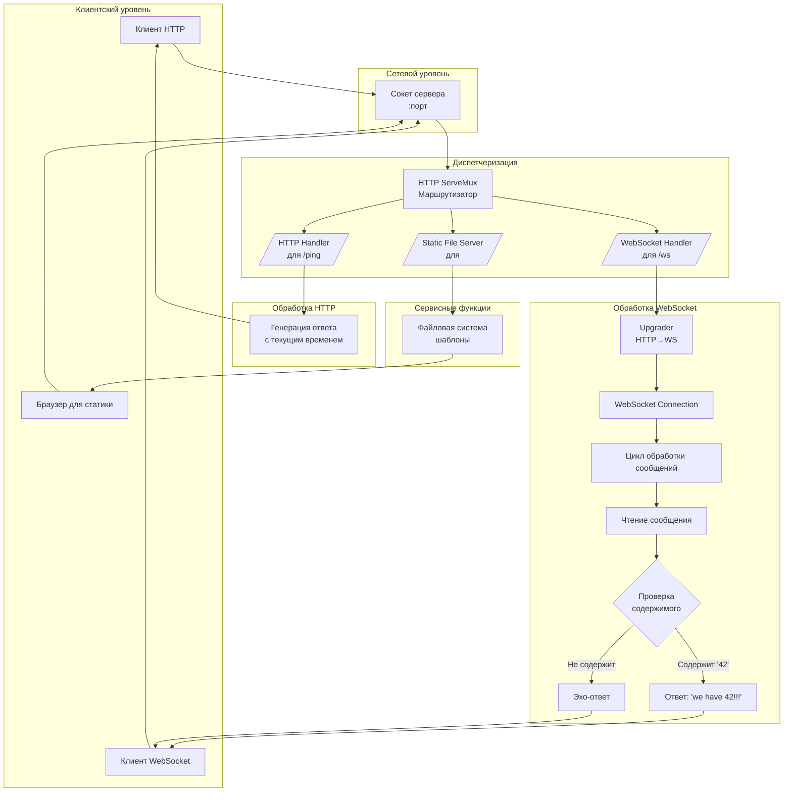

# Объяснение паттерна WebSocket-сервера с HTTP-маршрутизацией

## Основной паттерн и его компоненты

Этот код реализует **комбинированный сервер**, который объединяет несколько архитектурных паттернов:

### 1. **Интерфейсная абстракция**
Сервер скрывает детали реализации за интерфейсом, предоставляя только метод `Start()`. Это следует принципу **"программируйте на уровне интерфейсов, а не реализаций"**.

### 2. **Композиция компонентов**
Сервер состоит из трех основных компонентов:
- **HTTP маршрутизатор** - диспетчеризирует запросы
- **HTTP сервер** - обрабатывает сетевые соединения
- **WebSocket апгрейдер** - преобразует HTTP в WebSocket

### 3. **Многоуровневая обработка запросов**
Сервер обрабатывает три типа запросов разными способами:
- **Статические файлы** - обслуживаются напрямую
- **REST-like эндпоинты** - простые HTTP ответы
- **WebSocket соединения** - постоянные двусторонние соединения

## Визуализация архитектуры



## Принцип работы по шагам

### Фаза 1: Инициализация
1. Создается **маршрутизатор** (ServeMux) - мозг сервера, который знает, какой запрос куда направлять
2. Конфигурируется **HTTP сервер** с указанным адресом и маршрутизатором
3. Подготавливается **WebSocket конвертер** с настройками безопасности и производительности

### Фаза 2: Конфигурация маршрутов
Сервер настраивает три параллельных пути обработки:
- **Корневой путь (`/`)** → статические файлы (HTML, CSS, JS)
- **WebSocket путь (`/ws`)** → двустороннее соединение
- **Ping путь (`/ping`)** → простая HTTP проверка жизнеспособности

### Фаза 3: Обработка WebSocket соединений
При установке WebSocket соединения происходит **протокольная трансформация**:

1. **Апгрейд соединения**: HTTP-запрос превращается в постоянное WebSocket соединение
2. **Установка цикла чтения**: Сервер начинает слушать сообщения в бесконечном цикле
3. **Обработка сообщений**: Каждое сообщение проходит через бизнес-логику (проверка на "42")
4. **Отправка ответа**: Сервер реагирует на сообщение клиента

### Фаза 4: Параллельная работа
Сервер одновременно:
- Обслуживает статические файлы (если есть запросы)
- Отвечает на ping-запросы
- Поддерживает активные WebSocket соединения

## Ключевые архитектурные идеи

### 1. **Разделение ответственности**
Каждый компонент выполняет одну конкретную задачу:
- Маршрутизатор → направляет запросы
- FileServer → отдает файлы
- WebSocket обработчик → управляет соединениями

### 2. **Абстракция протоколов**
Сервер работает на двух уровнях протоколов:
- **HTTP** (статика и ping) - запрос-ответ
- **WebSocket** (реальное время) - постоянное соединение

### 3. **Паттерн "Цикл сообщений"**
Для WebSocket используется классический паттерн:
```
while соединение_активно:
    сообщение = получить_сообщение()
    результат = обработать(сообщение)
    отправить(результат)
```

### 4. **Graceful Degradation**
Сервер предоставляет разные интерфейсы для разных нужд:
- Простая проверка (`/ping`) для мониторинга
- Статика для веб-интерфейса
- WebSocket для сложных интерактивных сценариев

## Аналогия из реального мира

Представьте **гостиницу**:
- **Пинг-эндпоинт** - как звонок на ресепшн: "Вы на месте?" → "Да"
- **Статические файлы** - как брошюры в лобби: готовые материалы
- **WebSocket** - как личный консьерж: постоянная связь, двустороннее общение, индивидуальные ответы

## Паттерны, используемые в коде

1. **Фасад** - интерфейс WSServer скрывает сложность реализации
2. **Стратегия** - разные обработчики для разных типов запросов
3. **Цепочка ответственности** - маршрутизатор передает запрос нужному обработчику
4. **Состояние** - WebSocket соединение имеет жизненный цикл (установка, обмен, закрытие)

Этот подход позволяет создавать гибкие серверы, которые могут обслуживать разные типы клиентов и протоколов в рамках единой архитектуры.

# Детальное объяснение паттерна WebSocket-сервера с HTTP-маршрутизацией

## 1. Интерфейсная абстракция
**Принцип сокрытия реализации за контрактом.** Интерфейс WSServer определяет только один публичный метод `Start()`, что позволяет изменять внутреннюю реализацию без влияния на клиентский код. Этот подход следует принципу инверсии зависимостей - клиенты зависят от абстракции, а не от конкретной реализации. Такая архитектура упрощает тестирование, поскольку можно создавать mock-объекты, и обеспечивает гибкость при рефакторинге или замене реализации.

## 2. Композиция компонентов
**Сборка сложной системы из простых, независимых частей.** Маршрутизатор, HTTP-сервер и WebSocket-апгрейдер являются самостоятельными компонентами, каждый со своей четкой ответственностью. Композиция позволяет заменять или модифицировать отдельные компоненты без переписывания всей системы. Этот подход следует принципу единственной ответственности и облегчает поддержку кода, так как каждый компонент можно тестировать и развивать независимо.

## 3. Многоуровневая обработка запросов
**Разделение различных типов трафика по специализированным обработчикам.** Статические файлы обслуживаются стандартным файловым сервером, что эффективно для неизменяемого контента. Простые HTTP-эндпоинты обрабатываются легковесными функциями для быстрых операций. WebSocket-соединения требуют отдельного, долгоживущего обработчика для поддержки двусторонней связи. Такое разделение позволяет оптимизировать каждый путь обработки под его специфические требования и характеристики нагрузки.

## 4. Диспетчеризация через маршрутизатор
**Централизованное управление распределением запросов.** ServeMux выступает в роли диспетчера, который анализирует URL-пути и направляет запросы соответствующим обработчикам. Эта архитектура создает четкую точку конфигурации всех доступных эндпоинтов сервера. Маршрутизатор обеспечивает масштабируемость, так как новые обработчики добавляются без изменения существующей логики, и упрощает отладку благодаря централизованному логгированию и мониторингу.

## 5. Протокольная трансформация WebSocket
**Преобразование кратковременных HTTP-запросов в постоянные соединения.** Upgrader выполняет ключевую роль - преобразует стандартное HTTP-соединение в полноценный WebSocket-канал с сохранением состояния. Этот процесс включает обмен специальными заголовками и установку долгоживущего TCP-соединения. После успешного апгрейда сервер и клиент могут обмениваться сообщениями в реальном времени без накладных расходов HTTP-заголовков для каждого сообщения.

## 6. Цикличная обработка сообщений
**Непрерывный цикл "чтение-обработка-отправка" для устойчивой связи.** Сервер входит в бесконечный цикл, постоянно ожидая новые сообщения от клиента, что обеспечивает двустороннюю коммуникацию. Каждое полученное сообщение проходит через бизнес-логику сервера, которая определяет соответствующую реакцию. Этот паттерн позволяет поддерживать интерактивное взаимодействие, где клиент может инициировать обмен данными в любой момент, а сервер - реагировать на события в реальном времени.

## 7. Бизнес-логика в обработчике сообщений
**Интеграция предметно-ориентированной логики в коммуникационный поток.** Функция `has42` представляет собой простой пример бизнес-правила, интегрированного в обработку сообщений. Логика сервера анализирует содержимое каждого сообщения и определяет, какую ответную реакцию сгенерировать. Такая архитектура позволяет легко расширять функциональность, добавляя новые условия и правила обработки, сохраняя при этом чистоту коммуникационного слоя.

## 8. Параллельное обслуживание протоколов
**Поддержка множественных протоколов в рамках единого серверного процесса.** Сервер одновременно обрабатывает HTTP-запросы (статику и REST-эндпоинты) и WebSocket-соединения, что позволяет одному приложению обслуживать разные типы клиентов. Каждый протокол работает в своей собственной области, но использует общие ресурсы сервера. Это обеспечивает эффективное использование системных ресурсов и упрощает развертывание, так как не требуется запуск отдельных сервисов для разных типов трафика.

## 9. Graceful Degradation функциональности
**Предоставление альтернативных способов взаимодействия при различных условиях.** Простой ping-эндпоинт позволяет быстро проверять доступность сервера без установки сложных соединений. Статические файлы предоставляют базовый интерфейс для клиентов, не поддерживающих WebSocket. WebSocket-соединение предлагает полнофункциональное взаимодействие для продвинутых клиентов. Такой подход обеспечивает совместимость с широким спектром клиентов и условий сети.

## 10. Архитектурные паттерны в действии
**Сочетание проверенных шаблонов проектирования для создания надежной системы.** Фасад скрывает сложность системы за простым интерфейсом. Стратегия позволяет выбирать алгоритм обработки в зависимости от типа запроса. Цепочка ответственности передает запросы по цепочке обработчиков. Состояние управляет жизненным циклом WebSocket-соединений. Эти паттерны вместе создают структурированную, поддерживаемую архитектуру, которая масштабируется и адаптируется к изменяющимся требованиям.